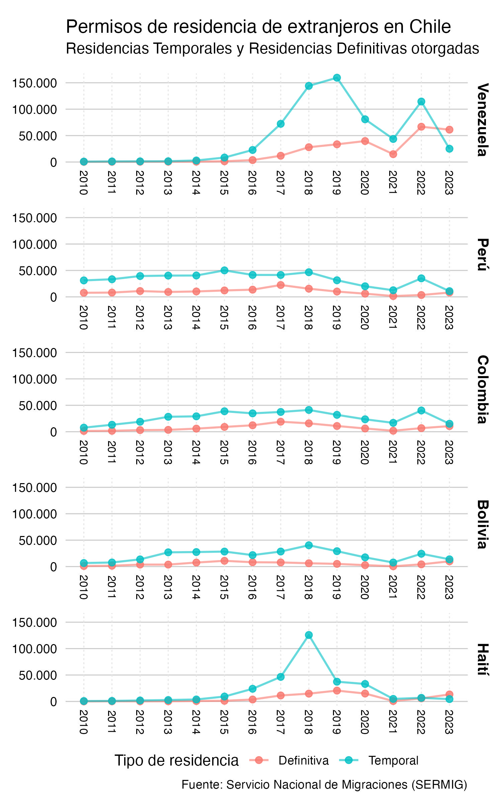

# Datos de migración en Chile

## Fuentes

**Residencias temporales y residencias definitivas:** [Servicio Nacional de Migraciones (SERMIG)](https://serviciomigraciones.cl/estudios-migratorios/datos-abiertos/)

**Estimación de extranjeros:** [Servicio Nacional de Migraciones (SERMIG)](https://serviciomigraciones.cl/estudios-migratorios/estimaciones-de-extranjeros/)